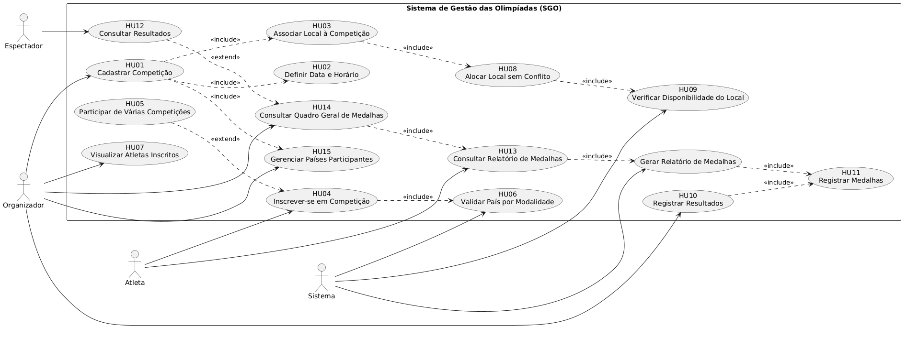
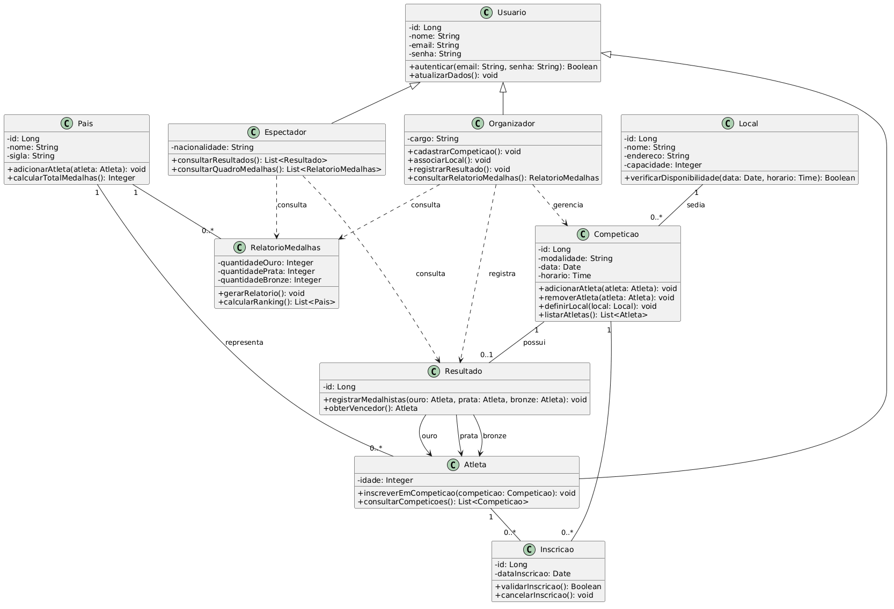
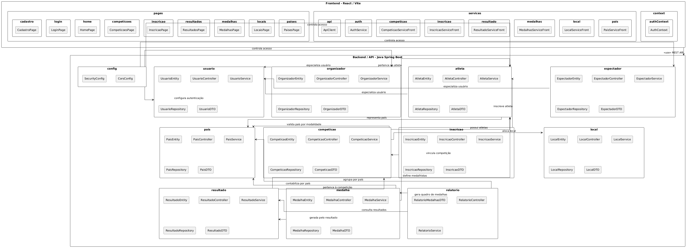
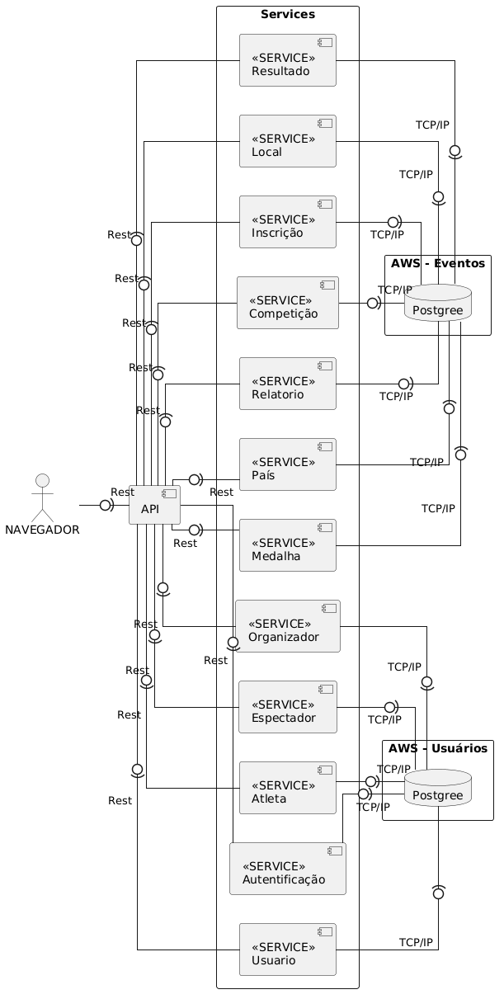
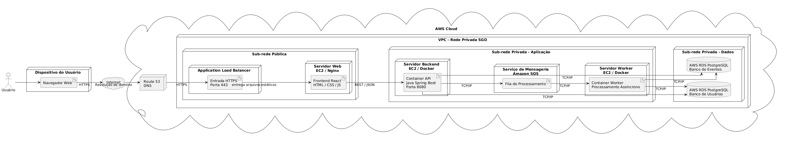

# 🏅 Sistema de Gestão das Olimpíadas - SGO

> Trabalho 1 — Primeira entrega da disciplina **Projeto de Software**  
> Curso: **Engenharia de Software — PUC Minas**  
> Professor: **João Paulo Carneiro Aramuni**

---

## 📌 Sobre o Projeto

O **Sistema de Gestão das Olimpíadas (SGO)** é uma proposta de sistema voltado para a organização e gerenciamento de eventos olímpicos.

O sistema tem como objetivo coordenar diferentes aspectos das Olimpíadas, incluindo o cadastro de competições, inscrição de atletas, alocação de locais para realização das provas, registro de resultados e geração de relatórios de medalhas por país.

Este repositório contém a modelagem UML do sistema, desenvolvida com **PlantUML**, conforme solicitado na primeira entrega da disciplina.

---

## 📚 Índice

- [Sobre o Projeto](#-sobre-o-projeto)
- [Histórias de Usuário](#-histórias-de-usuário)
- [Regras de Negócio](#-regras-de-negócio)
- [Diagramas UML](#-diagramas-uml)
- [Diagrama de Caso de Uso](#diagrama-de-caso-de-uso)
  - [Diagrama de Classes](#diagrama-de-classes)
  - [Diagrama de Pacotes](#diagrama-de-pacotes)
  - [Diagrama de Componentes](#diagrama-de-componentes)
  - [Diagrama de Implantação](#diagrama-de-implantação)
---

## 👤 Histórias de Usuário

### HU01
Como organizador, quero cadastrar competições, para gerenciar as modalidades das Olimpíadas.

### HU02
Como organizador, quero definir data e horário das competições, para organizar corretamente o cronograma dos eventos.

### HU03
Como organizador, quero associar um local à competição, para informar onde a prova será realizada.

### HU04
Como atleta, quero me inscrever em uma competição, para participar das Olimpíadas.

### HU05
Como atleta, quero participar de várias competições, para competir em diferentes modalidades.

### HU06
Como sistema, quero impedir que um atleta represente mais de um país na mesma modalidade, para manter a integridade das competições.

### HU07
Como organizador, quero visualizar os atletas inscritos em cada competição, para acompanhar os participantes.

### HU08
Como organizador, quero alocar locais sem conflito de horário, para evitar sobreposição de competições no mesmo local.

### HU09
Como sistema, quero impedir que um local receba duas competições ao mesmo tempo, para garantir a organização dos eventos.

### HU10
Como organizador, quero registrar os resultados das competições, para armazenar os vencedores e classificados.

### HU11
Como organizador, quero registrar medalhas de ouro, prata e bronze, para identificar os melhores atletas.

### HU12
Como espectador, quero consultar os resultados das competições, para acompanhar o desempenho dos atletas.

### HU13
Como organizador, quero consultar o relatório de medalhas, para acompanhar o desempenho das delegações.

### HU14
Como organizador, quero consultar o quadro geral de medalhas, para visualizar quais países estão liderando as Olimpíadas.

### HU15
Como sistema, quero armazenar informações dos países participantes, para relacionar atletas e medalhas corretamente.

---

## 📋 Regras de Negócio

O sistema foi modelado considerando as seguintes regras principais:

1. **Cadastro de competições**
   - O sistema deve permitir o cadastro de competições com modalidade, data, horário, local e atletas inscritos.

2. **Inscrição de atletas**
   - Atletas de diferentes países podem se inscrever em competições específicas.
   - Cada atleta pode participar de várias competições.
   - Um atleta só pode representar um país em cada modalidade.

3. **Alocação de locais**
   - Os locais das competições devem ser alocados evitando conflitos de horário.
   - Um local só pode receber uma competição por vez.

4. **Controle de resultados**
   - Após a realização da competição, o sistema deve registrar o atleta vencedor e os classificados em segundo e terceiro lugares.

5. **Relatórios de medalhas**
   - O sistema deve gerar relatórios de medalhas, mostrando o desempenho de cada país com base nas medalhas de ouro, prata e bronze.

---

## 🧩 Diagramas UML

Os diagramas foram desenvolvidos utilizando **PlantUML**, conforme solicitado na especificação do trabalho.

### Diagrama de Caso de Uso

### Diagrama de Classes

### Diagrama de Pacotes

### Diagrama de Componentes

### Diagrama de Implantação

